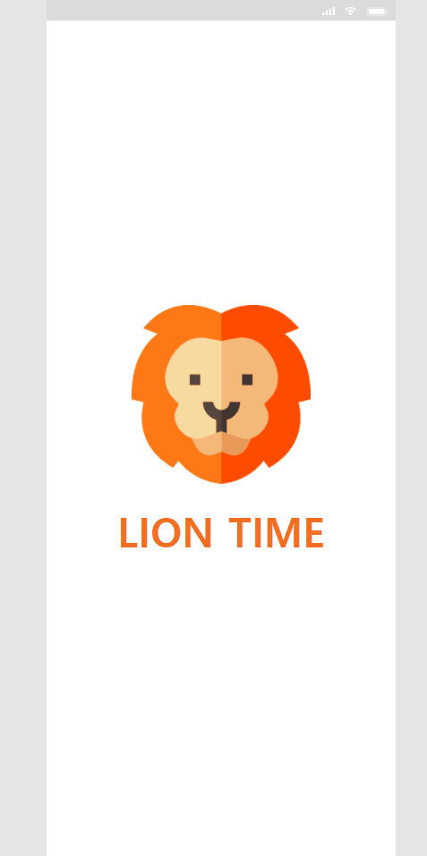
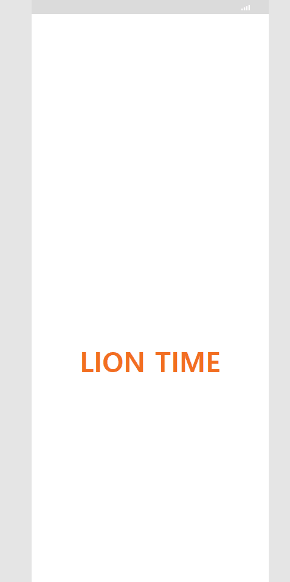
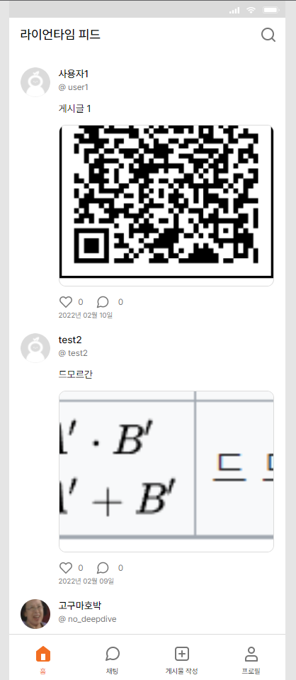
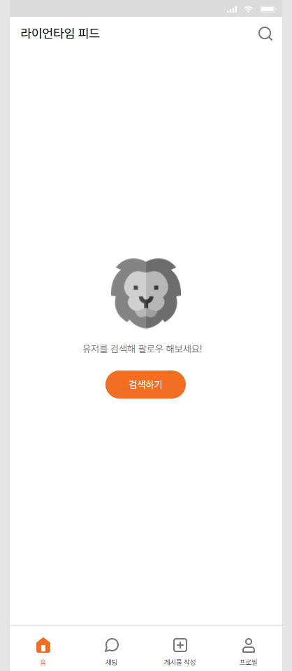
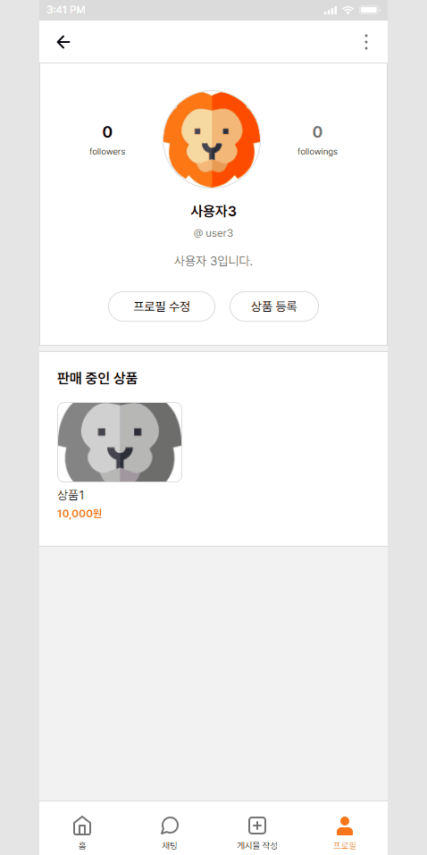
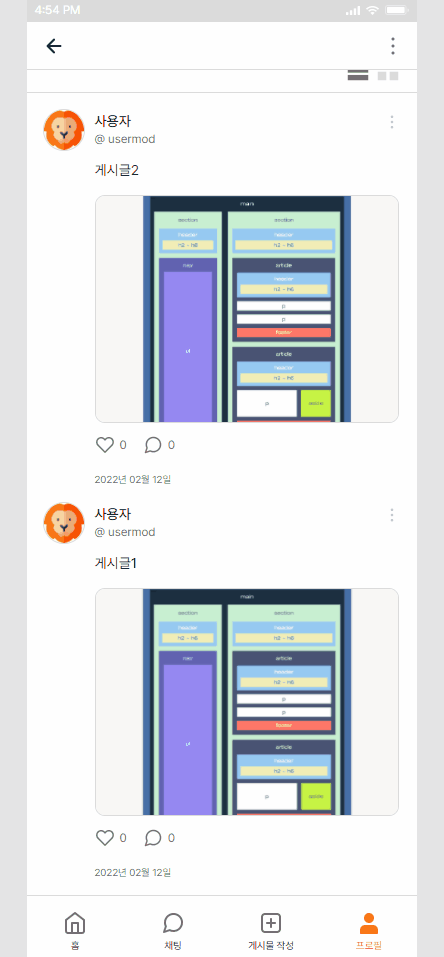

# LionTime

LionTime은 자신의 스토어에서 판매하는 상품을 등록하여 홍보할 수 있는 SNS입니다.
상품을 등록하지 않아도 일상을 공유하며 자유로운 SNS 활동을 할 수 있습니다. 글과 사진을 함께 게시물로 작성하여 자신의 일상을 공유할 수 있습니다. 다른 사용자를 팔로우하면 유저가 올린 게시물을 홈 피드에서 소식을 확인할 수도 있습니다.

## 멤버

-   김민찬 / 이춘구 / 전세원 / 정기수

## 1. 목표와 기능

### 1.1 목표

바닐라 자바스크립트를 이용해 SNS 서비스의 프론트엔드 구현과 API를 이용한 서버 연결

### 1.2 기능

-   로그인/회원가입
-   홈 피드
-   사용자 프로필
-   팔로워, 팔로잉
-   내 프로필 수정
-   상품 등록/수정/삭제
-   게시글 등록/수정/삭제
-   게시글 댓글/좋아요
-   채팅 목록
-   채팅방

## 2. 개발 환경 및 배포 URL

### 2.1 개발 환경

HTML, CSS, JavaScript, Git, GitHub [브랜치 전략](https://acute-repair-803.notion.site/LionTime-a0e407d3cf314098bbaa692af9576a0c)

### 2.2 배포 URL

[https://lion-time.netlify.app/](https://lion-time.netlify.app/)

## 3. 프로젝트 구조와 개발 일정

### 3.1 프로젝트 폴더 구조

```
│  .gitignore
│  .prettierrc
│  index.html
│  README.md
│
├─pages
│      404.html
│      chatList.html
│      chatRoom.html
│      home.html
│      join.html
│      login.html
│      loginEmail.html
│      post.html
│      postUpload.html
│      productAdd.html
│      profile.html
│      profileFollow.html
│      profileModification.html
│      search.html
├─css
│      404.css
│      chatList.css
│      chatRoom.css
│      footerNav.css
│      home.css
│      join.css
│      login.css
│      loginEmail.css
│      modal.css
│      post.css
│      postUpload.css
│      productAdd.css
│      profile.css
│      profileFollow.css
│      profileModification.css
│      reset.css
│      search.css
│      splash.css
│      statusBar.css
│
├─js
│      alert.js
│      chatList.js
│      chatRoom.js
│      footer.js
│      home.js
│      joinEmail.js
│      loginEmail.js
│      modal.js
│      post.js
│      postUpload.js
│      productAdd.js
│      profile.js
│      profileFollow.js
│      profileModification.js
│      search.js
│      splash.js
│      statusBar.js
├─font
└─images
```

### 3.2 개발일정

2022.01.03 ~ 2022.01.25

## 4. 역할분담

-   김민찬 - 채팅, 하단 탭 메뉴, 모달 버튼
-   이춘구 - 프로필, 팔로우
-   전세원 - 스플래쉬, 로그인, 회원가입, 홈, 검색
-   정기수 - 상품 등록, 게시글

## 5. UI

[Figma](https://www.figma.com/file/Gn6gQJdYwImYsEYSzBXhud/%EB%A9%8B%EC%82%AC_%ED%94%84%EB%A1%A0%ED%8A%B8%EC%97%94%EB%93%9C%EC%8A%A4%EC%BF%A8?node-id=7678%3A92530)

## 6. 메인 기능

<details>
    <summary>스플래쉬</summary>

-   서비스 접속 초기화면입니다.
-   splash 화면이 잠시 나온 뒤 다음 페이지가 나타납니다.
-   로그인을 하지 않은 경우 : 로그인 화면

    

-   로그인이 되어 있는 경우 : LionTime 피드
    

</details>

<details>
    <summary>회원가입</summary>
    

-   로그인 메인 화면에서 `회원가입` 을 누르거나 이메일 로그인 화면에서 `이메일로 회원가입` 을 누르면 회원가입 화면이 나타납니다.
-   회원가입 페이지에서는 유효성 검사가 로그인 페이지와 조금 다르게 진행됩니다.
-   이메일 주소 또는 비밀번호를 입력하고 입력창에서 포커스를 잃으면 바로 유효성 검사가 진행되고 통과하지 못한 경우 경고 문구가 각 입력창 하단에 표시됩니다.
-   이메일 주소의 형식이 유효하지 않거나 이미 가입된 이메일일 경우, 또는 비밀번호가 6자 미만일 경우에는 각 입력창 하단에 경구 문구가 나타납니다.
-   입력창에 focus 될 경우에는 선의 색이 변합니다.(회색, #DBDBDB → 주황색, #F26E22)
-   작성이 완료된 후, 유효성 검사를 통과할 경우 `다음` 버튼이 활성화되며, 버튼을 클릭하면 프로필 설정 폼이 나타납니다.
-   프로필 설정에 필요한 프로필 사진, 사용자 이름(2~10자 이내), 계정 ID, 소개를 입력받습니다.
-   프로필 사진은 등록하지 않을 경우 기본 이미지가 등록되게 합니다.
-   사용자 이름과 소개는 다른 사용자와 중복될 수 있습니다.
-   계정 ID는 중복이 불가합니다.
-   프로필 설정에서도 같은 방식으로 유효성 검사가 진행됩니다. 계정 ID에 대한 중복 유무와 형식을 검사합니다.
</details>

<details>
    <summary>로그인</summary>
    

-   로그인은 **로그인 메인 화면**과 **이메일 로그인 화면**으로 나눠져 있습니다.
-   SNS(카카오톡, 구글, 페이스북) 로그인은 구현하지 않았으며, 화면에 버튼만 배치했습니다.
-   로그인 메인 화면에서 `이메일로 로그인` 을 클릭하면 이메일로 로그인할 수 있는 화면으로 이동합니다.
-   이메일과 비밀번호를 모두 입력하면 `다음` 버튼이 활성화 됩니다. 입력되지 않은 입력창이 있다면 버튼은 활성되지 않습니다.
-   `로그인` 버튼을 클릭하면 이메일 주소와 로그인에 대한 유효성 검사를 진행하며, 이메일 주소 또는 비밀번호가 일치하지 않을 경우에는 경고 문구가 나타납니다.
-   입력창에 focus 될 경우에는 선의 색이 변합니다.(회색, #DBDBDB → 주황색, #F26E22)
</details>

<details>
    <summary>라이언타임 피드</summary>
    

-   감귤마켓 피드는 사용자들이 올린 게시글들이 표시되는 페이지입니다.
-   감귤마켓 피드에는 자신이 팔로우한 사용자의 게시글만 확인할 수 있습니다.
-   팔로우한 사용자가 없을 경우와 내가 팔로우한 사용자가 올린 게시글이 없는 경우, "유저를 검색해 팔로우 해보세요!" 문구와 함께 `검색하기` 버튼이 표시됩니다.

</details>

<details>
    <summary>검색</summary>
    

-   감귤마켓 피드 상단에 돋보기 버튼(검색 버튼)을 클릭하면 표시되는 페이지입니다.
-   사용자 이름을 검색할 수 있는 페이지입니다.
-   마크업만 구현한 상태입니다.
</details>

<details>
    <summary>프로필</summary>
    

-   사용자 프로필 페이지에서는 사용자 이름, 계정 ID, 소개, 팔로워 및 팔로잉 수, 판매 상품, 그리고 사용자가 업로드한 게시글을 확인할 수 있습니다.
-   사용자 정보 하단에는 `팔로우` 버튼이 있습니다. `팔로우` 버튼을 클릭하면 언팔로우 버튼으로 바뀝니다.
-   팔로워 및 팔로잉 수를 클릭하면 팔로워, 팔로잉 사용자 목록이 표시됩니다.
-   판매 중인 상품 섹션은 등록한 상품이 없을 경우에는 표시되지 않습니다.
-   게시글 섹션에서는 목록형과 앨범형으로 게시글들을 확인할 수 있습니다. 기본형은 목록형이며, 이미지가 없는 게시글은 앨범형에서 표시되지 않습니다.
-   사용자가 올린 게시글이 없을 경우에는 게시글이 나타나지 않습니다.
-   나의 프로필 페이지일 경우 - `프로필 수정` 버튼과 `상품 등록` 버튼이 표시됩니다. - 판매 중인 상품을 클릭하면 하단에 `상품 삭제`, `수정`, `웹사이트에서 상품 보기` 버튼이 포함된 메뉴가 나타납니다. (단, 나의 프로필 페이지가 아닐 경우 상품을 클릭하면 상품 판매 사이트로 이동됩니다.)
</details>

<details>
    <summary>팔로워, 팔로잉 목록</summary>
    

-   사용자 프로필 페이지에서 팔로워 및 팔로잉 수를 클릭하면 나타나는 페이지입니다.
-   목록은 사용자 프로필 사진, 이름, 계정 ID, 팔로우(또는 취소) 버튼으로 구성됩니다.
-   내가 팔로우 한 사용자일 경우 취소 버튼이, 내가 팔로우 하지 않은 사용자일 경우에는 팔로우 버튼이 표시됩니다.
</details>

<details>
    <summary>내 프로필 수정</summary>
    

-   나의 프로필 페이지에서 `프로필 수정` 버튼을 클릭하면 나타나는 페이지입니다.
-   유효성 검사가 통과되지 않을 경우 `저장` 버튼이 활성화되지 않습니다.
</details>

<details>
    <summary>상품 등록</summary>
    

-   나의 프로필 페이지에서 `상품등록` 버튼을 클릭하면 상품을 등록할 수 있는 페이지가 나타납니다.
-   상품 이미지, 상품명, 가격, 판매링크를 입력받을 수 있으며, 모든 입력이 완료되면 `저장` 버튼이 활성화됩니다.
-   상품명은 2~15자 이내로 입력되게 하고, 가격은 숫자를 입력하면 자동으로 원단위로 변환시킵니다.
-   URL로 상품 id를 전달 받으면 해당 상품을 수정합니다.
</details>

<details>
    <summary>게시글 작성 페이지</summary>
    
    
-   게시글을 작성할 수 있는 페이지로, 하단 메뉴바에서 `게시글 작성` 을 클릭하면 표시됩니다.
-   글과 사진이 업로드 되면 `업로드` 버튼이 활성화되고, 버튼을 누르면 게시글이 업로드됩니다.
-   사진은 우측 하단 버튼을 클릭하면 업로드할 수 있으며, 최대 3장까지 업로드 가능합니다.
</details>

<details>
    <summary>게시글 페이지</summary>
    

-   우측의 토글 버튼을 누르고 게시글 작성자는 `수정/삭제` 버튼으로 해당 기능을 수행할 수 있고 사용자들은 신고하기 버튼으로 해당 게시글을 신고할 수 있습니다.
-   `수정` 버튼 클릭 시 게시글 작성 페이지로 이동하고 URL로 게시글의 id를 전달합니다.
-   `삭제` 버튼 클릭 시 삭제 확인 여부를 묻는 모달창이 뜨고 게시글을 삭제할 수 있습니다.
-   이미지 개수가 표시되고 이미지의 왼쪽/오른쪽을 클릭해서 넘길 수 있습니다.
</details>

<details>
    <summary>하단 탭 메뉴</summary>
    

-   감귤마켓 하단에 페이지 이동을 위한 UI입니다.
-   홈, 채팅, 게시물 작성, 프로필 각각의 페이지로 이동합니다.
</details>

<details>
    <summary>모달</summary>
    

-   페이지에서 메뉴버튼을 누를 시 나오는 모달 창입니다.
-   각각의 페이지에서 버튼을 누르면 해당 페이지에 맞는 모달 메뉴가 생성된 후 보여집니다. (ex. 채팅방에서 눌렀다면 '채팅방 나가기' 버튼이 생성)
-   버튼을 누르면 해당 기능을 수행합니다.
</details>

## 7. 추가 기능

<details>
    <summary>댓글</summary>
    

-   게시글 하단에 말풍선 아이콘을 클릭하면 댓글을 확인하고 입력할 수 있는 페이지가 나타납니다.
-   댓글 입력창에 텍스트를 입력하면 `게시` 버튼이 활성화됩니다.
-   댓글 작성자는 본인의 댓글을 삭제할 수 있고 사용자들은 다른 댓글을 신고할 수 있습니다.
-   댓글 삭제 및 신고하기 기능을 구현합니다.
-   댓글 작성이 현재 시간으로 부터 몇 초, 분, 시간 전에 작성되었는지 표시합니다.
-   댓글 개수는 카운트 되어 말풍선 아이콘 우측에 표시됩니다.
</details>

<details>
    <summary>좋아요</summary>
    

-   게시글이 나타나는 모든 페이지에 해당합니다.
-   게시글 하단에는 하트 모양의 `좋아요` 버튼이 있습니다.
-   빈 하트를 클릭하면 색이 칠해진 하트로 변하고, 색이 칠해진 하트를 누르면 빈 하트로 변합니다.
-   좋아요 개수는 카운트 되어 하트 아이콘 우측에 표시됩니다.
</details>

<details>
<summary>무한 스크롤</summary>
    

-   프로필 페이지의 상품 목록과 게시글 목록, 팔로워/팔로잉 페이지의 사용자 목록에서 Intersection Observer API를 활용해 무한 스크롤을 구현하였습니다.
</details>

## 8. 개발하며 느낌점

-   ### 김민찬
    api를 다루는 내용이 아니어서 빠르게 css 작업을 마치고, 다른 분들을 도와드리고 싶었는데 생각보다 고칠 것도, 생각할 것도 많았습니다. 페이지마다, 버튼마다 다른 모달버튼을 적용하기 위해 고민을 많이 했고, 나름대로 만족할 수 있게 구현되어 좋았습니다. 다만 다른 팀 인원들도 잘 사용할 수 있게 보기 쉽게 구현했다면 더 좋았을 것 같습니다. 컨텐츠의 모듈화에 대해서 생각해 볼 수 있는 프로젝트였습니다.
-   ### 이춘구
    git을 활용한 협업에 익숙하지 않아서 헤메기도 했지만, 프로젝트의 마무리 단계에 가서는 git 사용법과 git flow에 익숙해질 수 있었습니다. 또한 vscode에서 제공하는 liveshare로 페어 프로그래밍을 하면서 다른 팀원들이 읽기 편한 코드 작성을 고민하고 그에 맞게 개선할 수 있었습니다. 팀원들과 소통하는 시간을 가질 때마다 작업이 수월해져서 협업에서 소통이 얼마나 중요한지 체감하는 계기가 되었습니다.  
    함수가 하나의 기능만 담당하도록 최대한 나누어 작성했으며, 반복되는 코드를 줄여 최대한 DRY하게 유지하려 노력했습니다. 팀원들의 역할을 페이지 단위로 나누기보단 컴포넌트 단위로 잘게 나눠서 협업의 여지를 늘렸으면 좀 더 완성도 높은 결과물이 나오지 않았을까 하는 아쉬움이 남습니다.
-   ### 전세원
    LionTime 프로젝트는 시멘틱 마크업에 신경을 쓰려 노력했지만, 기능 구현을 위해 어쩔 수 없이 들어가게 되는 태그들을 어떻게 넣어야 할 지 고민을 많이 하게 되는 프로젝트였습니다. 이미지를 가상요소의 배경으로 넣을때 스크린리더기가 충분히 읽을 수 있는 구조로 짜기 위해 노력했습니다.  
    이번 프로젝트를 통해 팀 협엽시 깃 사용법, 깃 충돌 관리법, 컨밴션 정하기 등 협업 시 필요한 많은 것들을 배웠습니다. 생각보다 많은 대화가 필요한 것이 초기 셋팅이라는 생각이 들었고 중간에도 틈틈히 소통을 해야 개발이 잘 이루어질 수 있겠다는 점을 느낀 프로젝트였습니다. 서로 틈틈히 소통을 하고 팀원들이 많이 도와준 덕에 처음 해본 프로젝트여서 많은 부족함이 있었지만 무사히 LionTime을 개발 할 수 있었습니다. 협업이 프로젝트에 얼마나 중요한지 알게 된 프로젝트입니다.
-   ### 정기수
    새로운 사람들과 프로젝트를 처음 해보게 됐는데 팀원분들이 모두 열심히 해준 덕분에 무사히 프로젝트를 마칠 수 있었습니다. 완벽하다고 할 순 없지만 프로젝트를 완수했다는 게 뿌듯하고 완벽하지 못하기 때문에 배울 수 있는 것이 더 많았다고 생각합니다.  
    프로젝트를 하면서 열심히 프로그래밍 하면서 오류를 해결하고 팀원들과 맞춰보기도 하면서 많이 배웠고 스스로 어떤 점이 부족한지 알게 되었습니다. 저를 한 단계 더 성장하게 해준 의미 있는 프로젝트였습니다.
