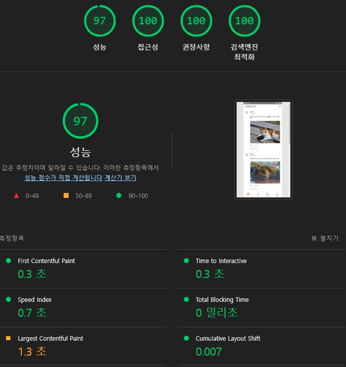
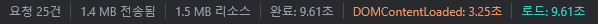
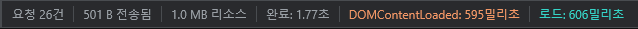
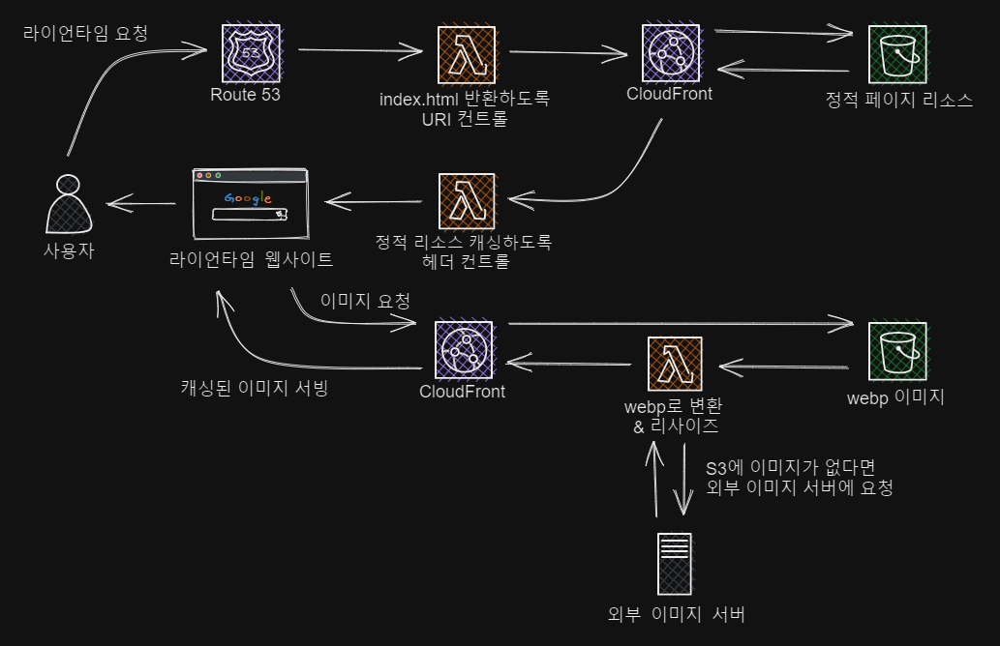

# LionTime

---

## 목차

1. [프로젝트 소개](#프로젝트-소개)
2. [배포 링크](#배포-링크)
3. [사용 기술](#사용-기술)
4. [리팩토링](#리팩토링)

---

## 프로젝트 소개

LionTime은 소식을 공유하고 물품을 판매할 수 있는 SNS 서비스입니다.  
[기존의 팀 프로젝트](https://github.com/LikeLion-FES-Team11/LionTime)를 `webpack`과 `AWS`를 활용해 리팩토링 한 개인 프로젝트입니다.

<br/>

## 배포 링크

<a href='https://liontime.shop' target='_blank'>https://liontime.shop</a>

**테스트 계정 정보**

- 아이디: lady@gaga.com
- 비밀번호 : ladygaga

❗ 로그인 화면에서 `이메일로 로그인` 방식으로 로그인하시기 바랍니다.

<br />

## 사용 기술

<p>
<!-- HTML -->

<!-- CSS -->

<!-- CSS Modules-->

<!-- JavasScript -->

<br />
<!-- Webpack -->

<!-- Babel -->

<!-- Github Actions -->

<br />
<!-- S3 -->

<!-- CloudFront -->

<!-- LAMBDA -->


<br />

## 리팩토링

### 결과 지표

#### Lighthouse

<table>
    <tr>
        <td style='font-weight:bold; text-align:center'>리팩토링 전</td>
        <td style='font-weight:bold; text-align:center'>리팩토링 후</td>
    </tr>
    <tr>
        <td>
            
        </td>
        <td>
            
        </td>
    </tr>
</table>

#### 네트워크 (빠른 3G 기준)

**리팩토링 전**

<div>
      
</div>

**리팩토링 후**

<div>
    
</div>

### 개선 사항

#### 최적화를 위한 설계



- 문제: 페이지 리소스(CSS, JS, 폰트)에 캐싱이 적용되어 있지 않음
  - 해결: cache-control 설정으로 브라우저에서 캐싱하도록 함
- 문제: 이미지 크기가 불필요하게 크고 차세대 형식(webp)이 아님
  - 해결: 이미지 서버를 구축해서 쿼리스트링으로 넘어온 이미지 사이즈에 맞게 리사이징 및 webp로 변환한 뒤 브라우저에서 캐싱하도록 함

#### CI/CD

`github actions`로 빌드, S3 업로드, CloudFront 캐시 초기화를 자동화

#### 코드 스플리팅

사용자와의 상호작용이 있어야 필요해지는 `BottomSheet`와 `Dialog` 컴포넌트에 코드 스플리팅을 적용함으로써 초기에 로드해야 할 스크립트의 용량 감소

```js
const module = await import(
  /* webpackChunkName: "BottomSheet" */ '@components/BottomSheet'
);
BottomSheet = module.default;

import(/* webpackChunkName: "ConfirmDialog" */ '../ConfirmDialog').then(
  ({ default: ConfirmDialog }) =>
    new ConfirmDialog({ action, postId, commentId, productId }).open(),
);
```

#### 커스텀 이벤트 활용

- 무한 스크롤이 필요한 페이지에서 관련 로직을 전부 작성한 이전 코드와 달리 관련 로직을 추상화
- target 요소가 뷰포트에 들어왔을 때 `intersect`라는 커스텀 이벤트를 발행해서
  콜백 함수를 실행할 수 있도록 함

```js
function intersectionObserver(target) {
  const intersectEvent = new CustomEvent('intersect');

  function handleIntersect(entries, observer) {
    entries.forEach((entry) => {
      if (entry.isIntersecting) {
        observer.unobserve(entry.target);
        target.dispatchEvent(intersectEvent);
      }
    });
  }

  const observer = new IntersectionObserver(handleIntersect);

  return observer;
}

// 유즈케이스
const feedList = document.querySelector('.feed-list');
const feedListObserver = intersectionObserver(feedList);
feedList.addEventListener('intersect', printFeed);
feedListObserver.observe(feedList.lastChild);
```

#### 이미지 컴포넌트

- 컴포넌트와 페이지를 가리지 않고 자주 사용되는 `` 태그를 컴포넌트화
- `width`와 `height` 넘겨서 `lambda@edge`로 리사이즈 한 이미지 로드
- 페이지 로드시 노출되지 않는(below the fold) 이미지는 `shouldLazy`에 `true`를 넘기도록 함으로써 lazy-loading 적용
- `fallback`으로 혹시 모를 이미지 로딩 에러에 대처

```js
function Image({ src, width, height, alt, shouldLazy = false, fallback }) {
  const img = document.createElement('img');

  img.src = attachImageURL({ src, width, height });
  img.alt = alt;
  if (shouldLazy) img.setAttribute('loading', 'lazy');
  img.onerror = ({ target }) => {
    target.onerror = null;
    target.src = fallback;
  };

  return img;
}

// 유즈케이스
const img = Image({
  src: authorImg,
  alt: accountname,
  shouldLazy: !isAboveTheFold,
  fallback: defaultProfileImageSmall,
  ...IMAGE.size.user.sm,
});
```

#### 스크롤 고정

`BottomSheet`나 `Dialog` 창이 떠있을 때 스크롤을 막아주는 기능을 클로져를 활용해 구현

```js
function useScrollFix(element) {
  let isFixed = false;

  function toggleScrollFix() {
    if (isFixed) {
      const scrollY = element.style.top;
      element.style = '';
      window.scrollTo(0, parseInt(scrollY || '0', 10) * -1);
      isFixed = false;
    } else {
      element.style = `
      width: 100%;
      top: -${window.scrollY}px;
      position: fixed;
      ${hasScroll(element, 'vertical') && 'overflow-y: scroll;'}
      `;
      isFixed = true;
    }
  }

  return toggleScrollFix;
}
```

#### 입력값 검증

개발자가 입력값의 검증조건을 파악하기 쉽도록 클래스의 메서드를 활용해 구현

```js
class InputValidator {
  #validators = [];
  #isValid;
  #cause;

  required(cause) {
    this.#validators.push({
      validator: (target) => {
        if (!target) return false;
        return true;
      },
      cause,
    });

    return this;
  }

  number(cause) { ... }
  minLength(length, cause) { ... }
  maxLength(length, cause) { ... }
  match(regex, cause) { ... }
  notMatch(regex, cause) { ... }

  validate(target) {
    for (const { validator, cause } of this.#validators) {
      const isValid = validator(target);

      this.#isValid = isValid;
      this.#cause = isValid ? undefined : cause;
      if (!isValid) break;
    }

    return { isValid: this.#isValid, cause: this.#cause };
  }
}

// 유즈케이스
const nameValidator = new InputValidator()
  .required(PRODUCT_ERROR.nameRequired)
  .minLength(2, PRODUCT_ERROR.nameMinLength)
  .maxLength(15, PRODUCT_ERROR.nameMaxLength);

const { isValid, cause } = nameValidator.validate(name);
```

[🔺 목차로 돌아가기](#목차)
